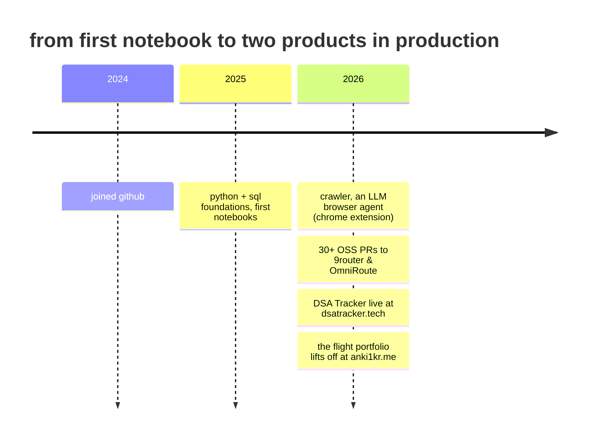
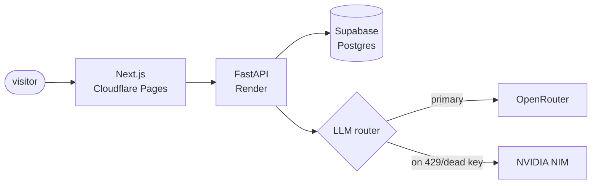
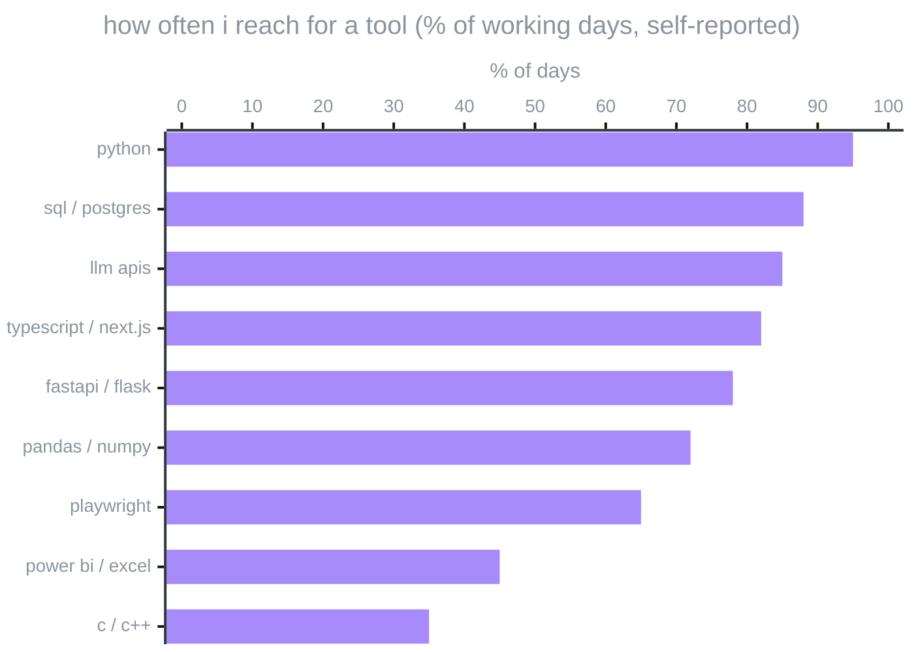

<picture>
  <source media="(prefers-color-scheme: light)" srcset="assets/header-light.svg" />
  
</picture>


<p>
  <a href="https://dsatracker.tech"></a>&nbsp;
  <a href="https://anki1kr.me"></a>&nbsp;
  <a href="https://www.linkedin.com/in/anki1kr"></a>
</p>

<p>
  <sub>
    pick a path →
    <a href="#github-activity">🏃 the numbers</a> ·
    <a href="#-dsa-tracker">🧑‍💻 the code</a> ·
    <a href="#-the-flight-portfolio">🚀 the portfolio</a>
  </sub>
</p>

## About

I build complete products: the Postgres schema, the API on top of it, the LLM pipeline behind it, and the frontend that makes sense of it all. My favourite constraint is $0 infrastructure. It taught me failover, caching, and quota juggling the honest way: get burned mid-demo first, fix it after.

Most of my time goes into **[DSA Tracker](https://dsatracker.tech)**, a live prep platform I run end-to-end. The rest goes into browser automation (Playwright, Chrome extensions), PRs to open-source LLM infrastructure, and [a portfolio you literally fly through](https://anki1kr.me).

**Right now:** animated algorithm visualizers for every pattern in my dataset (about halfway), sharper statistical reasoning, and prompt engineering that survives real users, not just a demo.

## The road so far



## Things I've built

### 🎯 DSA Tracker

**In production · [dsatracker.tech](https://dsatracker.tech)** · source private while it's a running business

One question, answered properly: *"what should I solve next for MY target role?"* A curated **370-problem dataset** mapped to **29 job roles**, running on **Next.js + FastAPI + Supabase Postgres**, deployed on Cloudflare Pages + Render, all free tier.

<details>
<summary><b>⚙️ Under the hood</b> — the architecture and the war stories</summary>
<br/>



- Multi-provider **LLM pipeline with auto-failover**, built after one provider's free tier nuked me mid-demo
- **Animated algorithm visualizers**: step-through traces generated by running the real algorithm and recording its state
- Progress sync from **7 platforms** (LeetCode, Codeforces, CodeChef, GFG, AtCoder, HackerRank, GitHub)
- Google OAuth, admin panel, rate-limited public APIs, and a support inbox that doesn't depend on the visitor's mail client

This project taught me more about production than everything else combined: OAuth edge cases, dead API keys, SEO, admin tooling, and a signup bug hiding in a database trigger.

</details>

Built with <code title="the dashboard and every rendered page">next.js</code> <code title="typed frontend, shared types with the api">typescript</code> <code title="the backend api and the llm router">fastapi</code> <code title="backend logic and the failover layer">python</code> <code title="the 370-problem dataset and every user's progress">postgres</code> <code title="postgres hosting + auth">supabase</code> <code title="hosts the frontend, free tier">cloudflare</code> <code title="hosts the fastapi backend, free tier">render</code>

### 🚀 The flight portfolio

**In production · [anki1kr.me](https://anki1kr.me)**

Instead of a scrolling page, my portfolio is a small open world built in **Three.js WebGL with no build step**. You pilot a ship between planets named About, Skills, Projects, Education and Contact. Land on one and an astronaut hops out, plants a flag, and the section opens.

<details>
<summary><b>🛰️ Flight manual</b> — how it stays fast and flyable</summary>
<br/>

- The ship and station are **modeled in Blender**, exported as GLB
- **Draco-compressed models** took first load from 18MB to ~3MB gzipped, launch-ready in under 5 seconds
- Custom **GLSL world-space joystick** for phones, plus a radar map of the whole sector
- Landing cinematic: astronaut emerges, plants a flag, waves at you, skippable, respects reduced motion
- In a hurry? There's a recruiter quick-view that skips the flying

</details>

Built with <code title="renders the whole 3d world">three.js</code> <code title="what three.js draws through">webgl</code> <code title="the custom mobile joystick shader">glsl</code> <code title="where the ship and station were modeled">blender</code> <code title="compressed the models ~6x for a fast load">draco</code> <code title="hosts the whole site, free">github pages</code>

## Open source

Beyond my own repos, I contribute to self-hosted **LLM router/proxy infrastructure**, the kind of tooling my own projects depend on: **30+ contributions across [9router](https://github.com/anki1kr/9router) and [OmniRoute](https://github.com/anki1kr/OmniRoute)** covering i18n coverage, multi-key load balancing, provider-compatibility fixes, and WebSocket bundling bugs.

Fixing infra you actually use is the fastest way I've found to learn a codebase you didn't write.

## Stack

- **Backend & data** — Python · FastAPI · Flask · PostgreSQL / Supabase · Pandas / NumPy. Runs DSA Tracker's API and its 370-problem dataset.
- **Frontend & 3D** — TypeScript · Next.js · React · Tailwind · Three.js + GLSL · Blender. DSA Tracker's dashboard and the flight portfolio.
- **Automation & analysis** — Playwright · Chrome extensions (MV3) · SQL · Power BI. Browser agents, scrapers, and the odd dashboard.
- **Currently learning** — statistical reasoning · async patterns · prompt engineering that survives production.

And the same stack as a chart, because I like charts:



## GitHub activity


## Find me

- 💼 [linkedin.com/in/anki1kr](https://www.linkedin.com/in/anki1kr)
- ✉️ [ankitkumar67930@gmail.com](mailto:ankitkumar67930@gmail.com)
- 🌍 [anki1kr.me](https://anki1kr.me), the flying portfolio
- 🧩 [leetcode.com/anki1kr](https://leetcode.com/anki1kr/)

Open to collabs and weird side projects. If you're working on something with LLMs, data pipelines, or browser automation, say hi.

<details>
<summary>🥚 p.s. you scrolled all the way down</summary>
<br/>

```
        /\
       /  \
      | ▲▲ |
      | () |      the astronaut waves at you.
     /|    |\     thanks for reading everything.
    / |    | \    the real ship is parked at anki1kr.me,
   |  | 🚀 |  |   engines warm. go take it for a spin.
    \_|____|_/
      /_/\_\
      ~~~~~~
```

**[launch →](https://anki1kr.me)**

</details>
